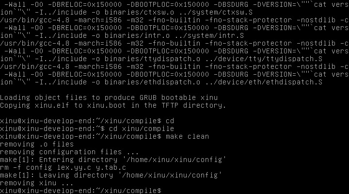

# Laporan Praktikum Sistem Operasi
## Modul 1, 2, dan 3: Instalasi, Arsitektur, dan Eksplorasi Xinu OS

### Identitas Praktikan
| Item | Keterangan |
|------|------------|
| **Nama** | Naya Smara Labina |
| **NIM** | 108072500151 |
| **Kelas** | IF-05-04 |
| **Asisten Praktikum** | Nuevalen & Galang |
| **Tanggal Praktikum** | 02-10-26 |

---

## 1. Tujuan Praktikum
1. Memahami aturan, tata tertib, dan persiapan *tools* utama praktikum Sistem Operasi (VirtualBox, Ubuntu, Xinu OS, dan Sourcetrail).
2. Memahami arsitektur *cross-development* pada sistem operasi *embedded* Xinu yang memisahkan *Development-System VM* dan *Backend VM*.
3. Mampu melakukan kompilasi *source code* Xinu dan menjalankannya pada *target machine* melalui jaringan (PXE/TFTP).
4. Mampu mengakses dan mengeksplorasi perintah dasar *shell* Xinu menggunakan koneksi *serial port* (Minicom).

---

## 2. Dasar Teori & Arsitektur Sistem
Xinu OS adalah sistem operasi kecil yang dikhususkan untuk lingkungan *embedded*. Pengembangannya menggunakan paradigma **cross-development**, di mana programmer menggunakan komputer standar (*host/development-system*) untuk menulis dan mengompilasi kode, lalu mengunggah *image* OS tersebut ke komputer target (*backend*) untuk dijalankan.

Pada praktikum ini, arsitektur yang digunakan terdiri dari dua *Virtual Machine* (VM):
1. **Development-System VM:** Berisi OS Debian Linux, *source code* Xinu, *compiler*, DHCP Server, dan TFTP Server.
2. **Backend VM:** Komputer target kosong yang akan melakukan *booting* melalui jaringan (PXE), mengambil *image* Xinu dari TFTP server, dan menjalankan Xinu OS.
Kedua VM ini dihubungkan melalui *Virtual Serial Port* agar praktikan dapat memberikan perintah ke Xinu dari terminal Development-System.

---

## 3. Langkah Kerja dan Hasil Eksplorasi

### 3.1 Login dan Kompilasi Source Code Xinu
Langkah pertama dilakukan pada **Development-System VM**. VM dijalankan dan dilakukan *login* ke dalam sistem operasi Debian.
- **Username:** `xinu`
- **Password:** `xinurocks`

Setelah masuk ke terminal, praktikan berpindah ke direktori kompilasi Xinu dan membersihkan *build* sebelumnya agar memastikan *image* yang dikompilasi adalah yang terbaru.
```bash
$ cd xinu/compile
$ make clean
$ make
```
**Hasil:** 
Proses `make` akan mengompilasi seluruh *source code* C menjadi *image* bernama `xinu.elf`. Sistem juga secara otomatis menyalin *image* tersebut ke direktori server TFTP (`/srv/tftp/xinu.boot`) agar siap diunduh oleh *Backend VM*.


*Gambar 1: Proses kompilasi source code Xinu menggunakan perintah `make` pada Development-System VM.*

### 3.2 Booting Backend VM via PXE
Selanjutnya, **Backend VM** dijalankan. Karena Backend VM tidak memiliki hardisk yang berisi OS, ia akan melakukan *network booting*.
1. Muncul tampilan **GRUB** bootloader.
2. Backend VM meminta IP Address dari DHCP Server (yang berjalan di Development-System VM).
3. Backend VM mengunduh file `xinu.boot` melalui protokol TFTP.
4. Xinu OS berhasil dimuat ke memori dan berjalan.



*Gambar 2: Tampilan Backend VM saat melakukan booting melalui jaringan (PXE) dan memuat GRUB.*

### 3.3 Koneksi Serial Port menggunakan Minicom
Untuk berinteraksi dengan Xinu yang sedang berjalan di Backend VM, praktikan kembali ke terminal **Development-System VM** dan menjalankan aplikasi *serial communication* bernama `minicom`. Karena mengakses *hardware* secara langsung, perintah ini memerlukan hak akses *root*.
```bash
$ sudo minicom
```
*(Password: `xinurocks`)*

**Hasil:** 
Terminal Development-System kini terhubung langsung ke *console* Xinu di Backend VM. Prompt terminal berubah dari `xinu@xinu-develop-end:$` menjadi **`xsh$`**, yang menandakan bahwa praktikan kini berada di dalam *Xinu Shell*.


*Gambar 3: Koneksi berhasil melalui Minicom, ditandai dengan munculnya prompt `xsh$`.*

### 3.4 Eksplorasi Perintah Shell Xinu
Pada prompt `xsh$`, praktikan dapat memberikan perintah langsung ke kernel Xinu. Perintah pada Xinu berbeda dengan Linux pada umumnya. Praktikan mencoba menjalankan perintah `help` untuk melihat daftar perintah yang didukung oleh *shell* Xinu.

```bash
xsh$ help
```


*Gambar 4: Output dari perintah `help` yang menampilkan daftar command bawaan Xinu OS.*

Selain itu, dilakukan eksplorasi direktori menggunakan perintah `ls` dan `cd` untuk melihat struktur sistem file sederhana yang dimiliki oleh Xinu, serta mencoba perintah `halt` atau `shutdown` untuk mematikan sistem.

---

## 4. Pembahasan
Berdasarkan praktikum yang telah dilakukan, terdapat beberapa poin penting terkait arsitektur dan cara kerja Xinu OS:

1. **Pemisahan Host dan Target (Cross-Development):** 
   Penggunaan dua VM sangat merepresentasikan kondisi dunia nyata pada pengembangan sistem *embedded* (seperti IoT atau *microcontroller*). Developer tidak mengompilasi kode di perangkat target yang sumber dayanya terbatas, melainkan di *host* (Development VM), lalu mentransfer *binary/image* hasilnya.
2. **Mekanisme Network Booting (PXE & TFTP):**
   Backend VM tidak membutuhkan media penyimpanan lokal. Saat dinyalakan, *Network Interface Card* (NIC) virtualnya mencari server DHCP. Development VM merespons dengan memberikan IP dan menunjuk ke server TFTP. Backend VM kemudian mengunduh `xinu.boot` dan mengeksekusinya langsung di RAM.
3. **Peran Serial Port dan Minicom:**
   Karena Backend VM berjalan tanpa antarmuka grafis (headless) dan fokus pada *embedded system*, interaksi *input/output* dilakukan melalui *serial port*. `minicom` bertindak sebagai *terminal emulator* yang menjembatani *keyboard* di Development VM ke *console* Xinu di Backend VM.
4. **Xinu Shell (`xsh$`):**
   Shell pada Xinu (`shell.c`) sangat minimalis. Ia memproses *input* string, mengekstrak nama perintah, dan memanggil *system call* atau fungsi internal kernel yang sesuai. Perintah seperti `help`, `uptime`, atau `kill` dieksekusi langsung di ruang kernel karena Xinu tidak memiliki pemisahan *user-space* dan *kernel-space* yang ketat seperti Linux modern.

---

## 5. Kesimpulan
1. Praktikan telah memahami tata tertib laboratorium dan berhasil menyiapkan lingkungan *cross-development* menggunakan Oracle VM VirtualBox.
2. Arsitektur Xinu OS membutuhkan dua mesin: **Development-System** (untuk kompilasi dan server TFTP/DHCP) dan **Backend** (sebagai target eksekusi *image* Xinu).
3. Proses kompilasi `make` menghasilkan *image* yang berhasil di-*booting* oleh Backend VM melalui jaringan (PXE).
4. Praktikan berhasil mengakses *Xinu Shell* (`xsh$`) melalui koneksi `minicom` dan mampu mengeksplorasi perintah-perintah dasar sistem operasi Xinu. Pemahaman ini menjadi fondasi penting untuk modul selanjutnya, yaitu pembacaan *source code*, manajemen proses, dan *system call*.
